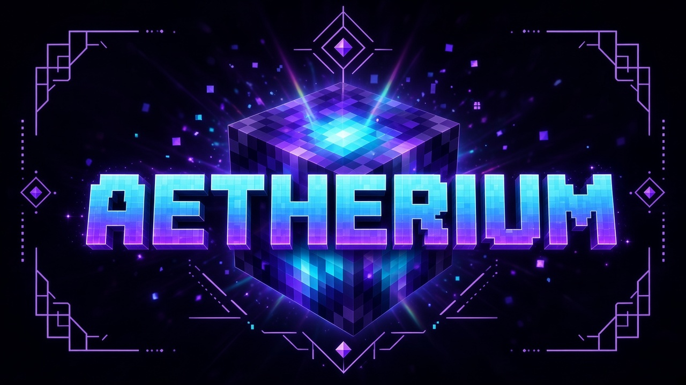
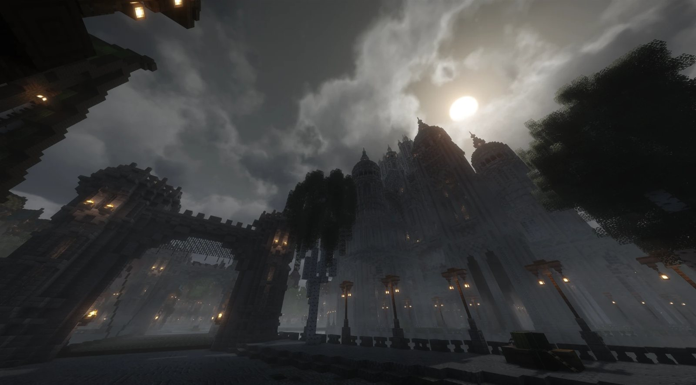
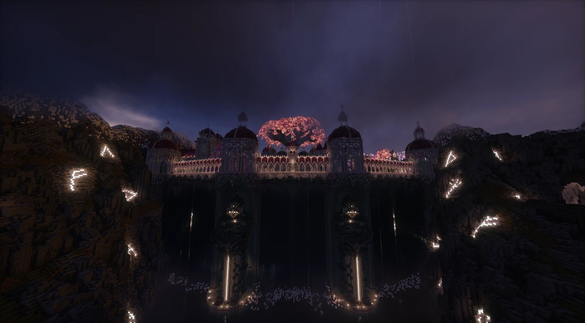
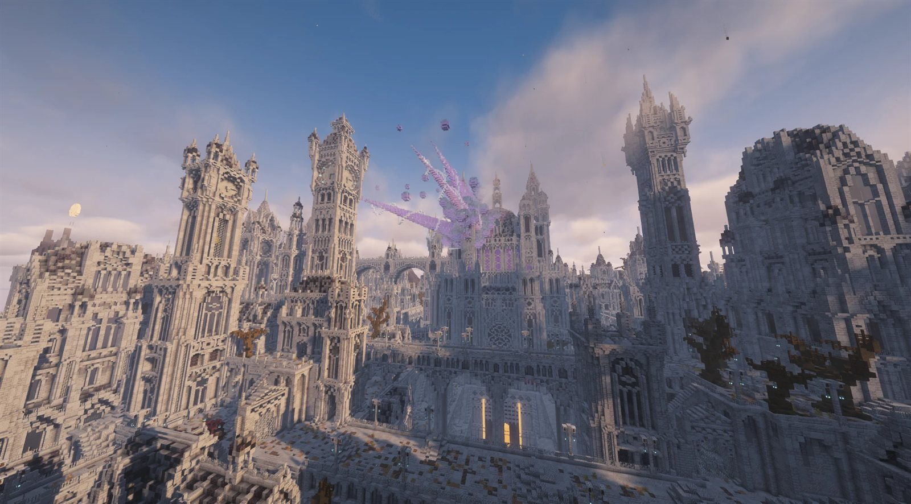
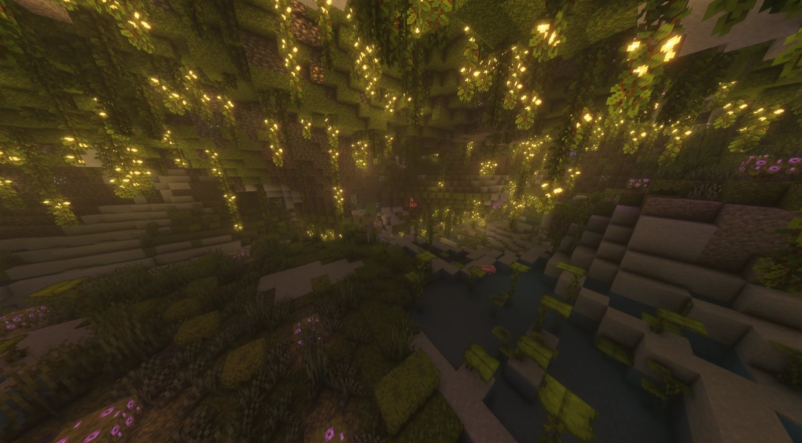
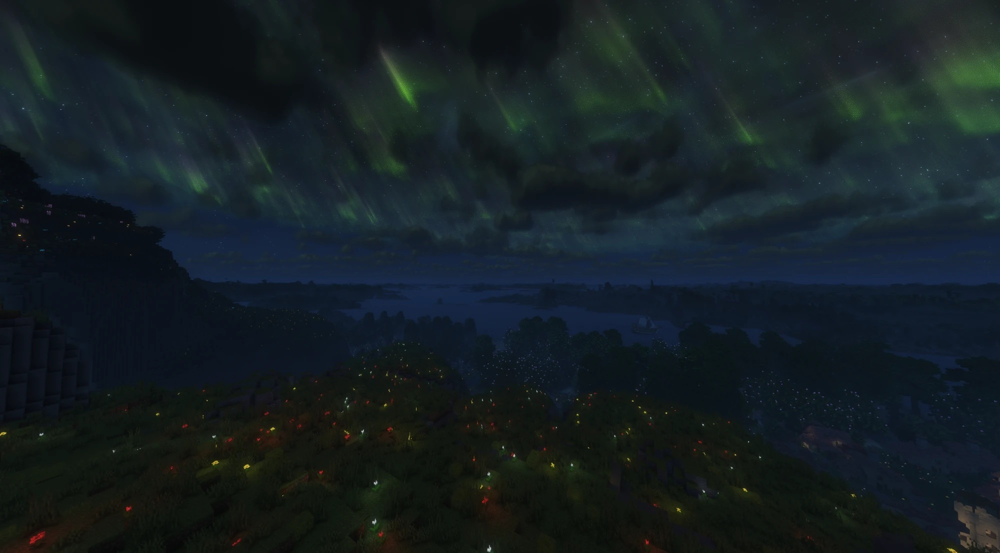
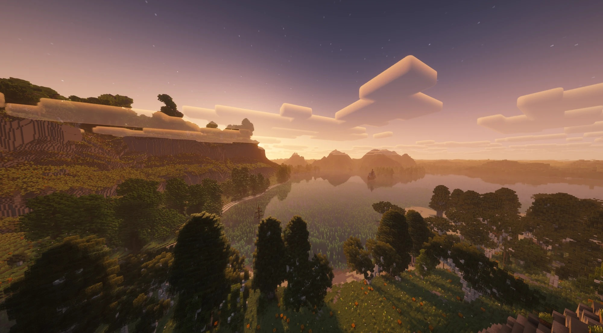
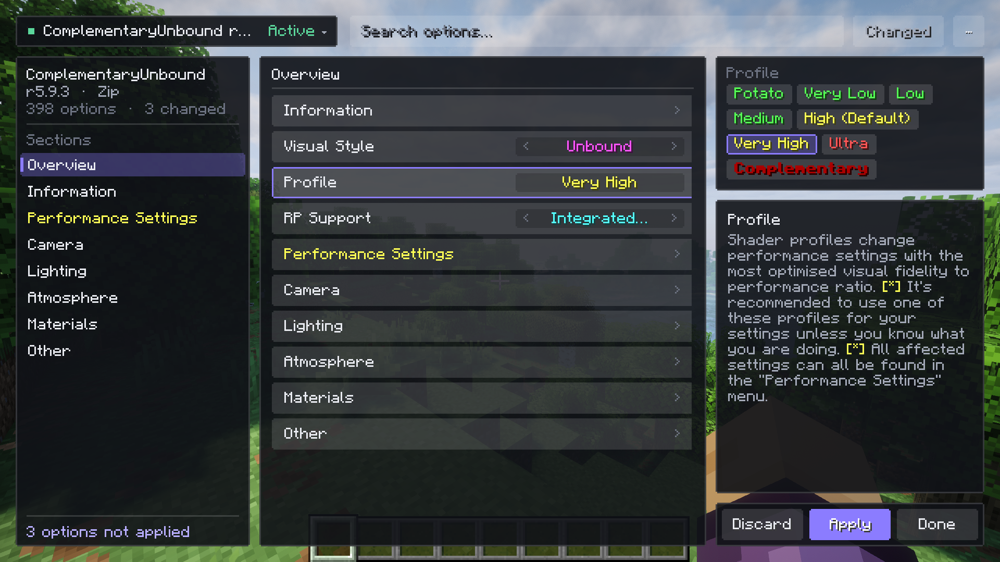
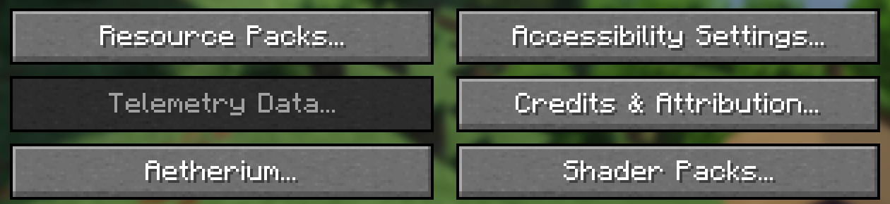

<div align="center">

# Aetherium




<a href="https://modrinth.com/mod/sodium"></a>

<br>
<a href="https://fabricmc.net"></a>
<a href="https://neoforged.net"></a>

**Shader packs on Minecraft's Vulkan renderer.**

A client-side mod that runs standard shader packs natively on Vulkan, with its own shader-engine optimisations,
a searchable settings screen and a few quality-of-life extras.

<!-- TODO: download and version badges (Modrinth, CurseForge, GitHub release) once Aetherium is published there. -->

</div>

<p>


</p>
<p>


</p>

<p align="center"><sub>Shot with Complementary Unbound and Spooklementary.</sub></p>

<p>


</p>

<p align="center"><sub>Far terrain from Distant Horizons, shaded by the pack.</sub></p>

<!-- TODO: credit the builds shown. -->

---

## Why Aetherium

Minecraft is moving to Vulkan. The game now ships its own Vulkan renderer alongside OpenGL, and that is where its
rendering is heading. Shader packs, though, grew up on OpenGL: OptiFine created the format, and Iris carried it to
modern versions, both built around the OpenGL pipeline. Aetherium runs those same packs natively on the Vulkan
renderer, so they move forward with the game instead of holding it back on the old path.

At the same time, the optimisations Sodium pioneered are finding their way into vanilla bit by bit. Aetherium leaves
terrain rendering to Sodium and builds on it, and puts its own effort where nothing else does: a fast shader engine
on Vulkan, with every optimisation measured before it is turned on.

## Highlights

- **Shader packs on Vulkan.** Standard-format packs (`shaders.properties`) are converted to SPIR-V and run on the
  game's own Vulkan renderer: gbuffer, shadow, full-screen, compute and geometry programs, custom images and
  buffers and LabPBR material maps. Tested with **[22 popular packs](docs/tested-packs.md)**, among them Complementary, BSL, Photon
  and Sildur's, every one of which compiles completely.
- **Works with Distant Horizons.** Its far terrain is shaded by the pack's own Distant Horizons programs, shadows
  included, so the view reaches the horizon with the pack's look. Without a pack it draws as usual.
- **Built for frame rate.** About twenty measured engine optimisations. Each one can be switched off on its own, and
  is measured against an all-off baseline before it is turned on by default. See [Performance](docs/performance.md).
- **Render scale with FSR 1.0.** Draw the world at 50–100% of the window and upscale it, while the interface stays
  sharp.
- **A pack screen that is easy to use.** Profiles, search, a "changed only" filter, inline reset, live preview
  (hold Tab), import and export, and drag-and-drop install.
- **Fast pack loading.** Packs load in the background, with a small progress indicator in the corner, and a disk
  cache roughly halves the time to load the same pack again.
- **Memory savings.** Shared block shapes, shared empty item data and a cheaper chunk-palette check.
- **Extras.** Hold-to-zoom with a coordinates and target readout, a pixel-exact centred crosshair, and a prompt
  that offers to switch the game to Vulkan.

The full list is in [Features](docs/features.md).


## Requirements

| Requirement | Version or details |
|---|---|
| Minecraft | 26.3 |
| Mod loader | Fabric Loader 0.19.5+ with Fabric API, or NeoForge 26.3.0.23-beta+ |
| Graphics API | Vulkan. If the game starts on OpenGL, Aetherium offers to switch it. |
| Required mods | [Sodium](https://modrinth.com/mod/sodium) 0.9.2 or newer for Minecraft 26.3, and Fabric API on Fabric |
| GPU | Any GPU with a working Vulkan 1.2 driver. <!-- TODO: confirm the minimum Vulkan version and list tested GPUs. --> |

Aetherium does not work alongside other shader-pack mods; the mod metadata lists them as incompatible. See
[Compatibility](docs/compatibility.md).

## Installation

1. Install Minecraft 26.3 with Fabric (and Fabric API) or NeoForge.
2. Put the Aetherium jar and Sodium (plus Fabric API on Fabric) into your `mods` folder.
3. Start the game. If it is not running on Vulkan, Aetherium offers to switch the Graphics API and quit. Start the
   game again afterwards.
4. Put shader packs (`.zip` files or folders) into `shaderpacks`, or drop them onto the shader pack screen.

<!-- TODO: download link / release channel. -->

## Getting started

| Key | Action |
|---|---|
| <kbd>O</kbd> | Open the shader pack screen |
| <kbd>K</kbd> | Turn the active shader pack on or off |
| (unbound) | Reload the active pack from disk |
| <kbd>Z</kbd> (hold) | Zoom; scroll to change the magnification |



All keys can be rebound under Controls › Key Binds. Aetherium's own settings are under **Options › Aetherium...**,
next to **Shader Packs...**:



## Documentation

| Page | What it covers |
|---|---|
| [Features](docs/features.md) | Everything Aetherium does, in detail |
| [Shader packs](docs/shader-packs.md) | Installing packs, the pack screen, supported pack features, limits |
| [Settings](docs/settings.md) | Every settings page, the config files and the key bindings |
| [Zoom and HUD](docs/hud.md) | Zoom, the readout panels and the centred crosshair |
| [Performance](docs/performance.md) | The optimisations, what they do and what they measured |
| [Compatibility](docs/compatibility.md) | Mods, shader packs and platforms |
| [Tested shader packs](docs/tested-packs.md) | Every pack Aetherium was tested with, and the results |
| [macOS](docs/macos.md) | Running on Apple silicon through MoltenVK |
| [FAQ and troubleshooting](docs/faq.md) | Common problems and their fixes |
| [Development](docs/development.md) | Building, the test harness, benchmarks and how changes are made |
| [Roadmap](docs/roadmap.md) | Planned and open work |
| [Changelog](CHANGELOG.md) | What changed in each version |

## Building from source

Building needs JDK 25, Git and Bash (Git Bash on Windows):

```bash
bash benchmarks/tools/build-lod.sh     # once: builds the level-of-detail jars the compat code compiles against
./gradlew :fabric:build :neoforge:build
```

The jars are written to `fabric/build/libs/` and `neoforge/build/libs/`. [Development](docs/development.md) covers dev
runs, the game-free test harness and benchmarks.

## Credits

Aetherium stands on the work of others. With thanks to:

- **[OptiFine](https://optifine.net)** by sp614x, which created the shader pack format that Aetherium runs.
- **[Iris](https://github.com/IrisShaders/Iris)**, the inspiration for bringing shader packs to modern Minecraft
  and for much of how a pack is read and laid out.
- **[FerriteCore](https://github.com/malte0811/FerriteCore)** by malte0811, the inspiration for Aetherium's memory
  optimisations.
- **[VulkanMod](https://github.com/xCollateral/VulkanMod)** and **Beryl** by Collateral, which showed what a Vulkan
  renderer for Minecraft can do. <!-- TODO: link for Beryl. -->

<!-- TODO: bundled libraries and their licences (shader parser, preprocessor, expression evaluator, ...). -->
<!-- TODO: anyone else to thank (testers, pack authors). -->

## License

Aetherium is free software under the GNU Lesser General Public License v3.0 only (LGPL-3.0-only). In short:

- You may use it, include it in modpacks, and share it.
- You may modify it and reuse its code, as long as you credit Aetherium, keep the licence, and share the source of
  your changes to Aetherium's code under the same licence.
- Mods and programs that only use Aetherium, without copying its code, can carry any licence.

This summary is for convenience; the licence text in [`LICENSE`](LICENSE), which supplements the GNU GPL v3.0 in
[`COPYING`](COPYING), is what applies.
