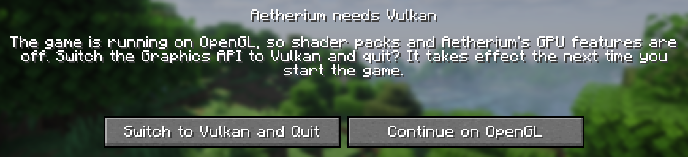

# FAQ and troubleshooting

- [Shader packs do nothing](#shader-packs-do-nothing)
- [The game asks to switch to Vulkan every time](#the-game-asks-to-switch-to-vulkan-every-time)
- ["Vulkan could not start"](#vulkan-could-not-start)
- [A pack fails to load](#a-pack-fails-to-load)
- [A pack looks wrong](#a-pack-looks-wrong)
- [Low frame rate with a pack](#low-frame-rate-with-a-pack)
- [Where are my settings?](#where-are-my-settings)
- [Can I use it with another shader mod?](#can-i-use-it-with-another-shader-mod)

## Shader packs do nothing

Shader packs need the game to run on Vulkan. Aetherium checks this when the title screen first opens and offers to
switch. If you dismissed it, it asks again on the next start. Also check that the pack is applied (the pack switcher
says *Active*) and not turned off with <kbd>K</kbd>.

## The game asks to switch to Vulkan every time

You chose **Continue on OpenGL**. Choose **Switch to Vulkan and Quit** once, then start the game again.

## "Vulkan could not start"

The Graphics API is set to Vulkan, but the driver could not start it, so the game fell back to OpenGL. Update your
graphics driver. On laptops with two GPUs, make sure the game runs on the dedicated one.

<!-- TODO: known driver versions with problems. -->

## A pack fails to load

The pack switcher shows *Failed to load*. The reason is in `logs/latest.log`: search for the pack's name. Common causes:

- The pack needs a feature Aetherium does not support yet (see [Known limits](shader-packs.md#known-limits)).
- One of the pack's options produces code that does not compile. Try the pack's default profile.

<!-- TODO: how to report a broken pack (what to attach). -->

## A pack looks wrong

- Make sure **Exact NaN handling** and **Zeroed shader variables** are on (**Aetherium › Shaders**). Some packs turn
  black or flicker without them.
- Try with **Render scale** at 100%.
- Compare with the pack's default profile.

<!-- TODO: known visual differences per pack live in the compatibility table. -->

## Low frame rate with a pack

- Lower **Render scale** (Aetherium › Shaders) to 75% or 67%. FSR keeps the picture sharp.
- Lower **Shadow distance** or **Shadow map scale**; shadows are often the most expensive part of a pack.
- Use a lighter profile of the pack.
- Check that every optimisation is on: **Aetherium › Performance › Presets › Recommended**.
- On Windows with many CPU threads, **Aetherium › Advanced › System** says whether Java sees all of them, and which
  JVM flag fixes it if not.

## Where are my settings?

`config/aetherium.json` holds Aetherium's settings, and `shaderpacks/<pack>.txt` holds each pack's options. See
[Settings › Config files](settings.md#config-files).

## Can I use it with another shader mod?

No. Only one mod can run shader packs, and the mod metadata refuses to load Aetherium alongside the others.
