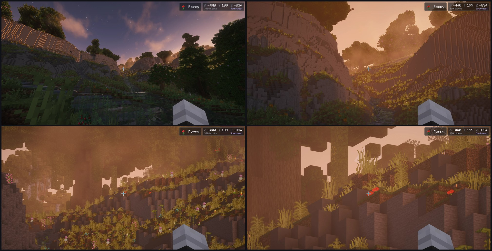
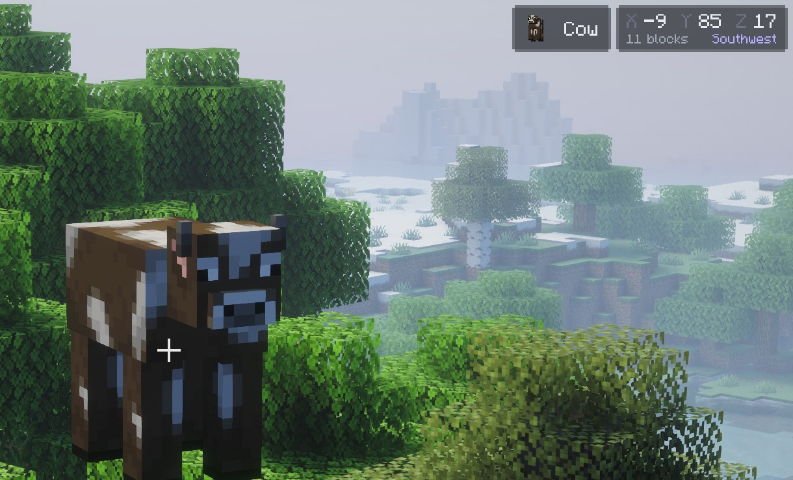

# Zoom and HUD

- [Zoom](#zoom)
- [The readout](#the-readout)
- [Centred crosshair](#centred-crosshair)
- [Settings](#settings)

## Zoom

Hold <kbd>Z</kbd> to zoom. While zoomed:

- **Scroll** to zoom further in or out, between the least and most zoom. Each notch changes the magnification by 20%.
- Every zoom starts at the **starting zoom** (4.0× by default), whatever you scrolled to last time.
- The zoom eases in and out at the same speed at any frame rate.
- The mouse turns slower in step with the magnification, so a movement moves the picture equally far at any zoom.
  **Zoomed sensitivity** scales that, and the **cinematic camera** (on by default) smooths it.

Releasing the key returns the view, and restores your own cinematic camera setting.

## The readout

While zoomed, two small glass panels show what the crosshair is on, as far as your render distance reaches (or the
server's, if that is shorter). Mobs are only found within the distance the server sends them, usually less:

- **Coordinates panel.** The block's X, Y and Z, with the distance and the direction you face (North, Northeast, ...)
  below in smaller type.
- **Target panel.** A small 3D preview and the name. Blocks show the item you would pick with middle-click (tall
  seagrass shows seagrass, a wall torch shows a torch); water and lava show their bucket. Mobs show themselves,
  live, turned three-quarters.

Mobs take priority over the block behind them. Dropped items and other entities are looked through. With nothing in
range the coordinates panel shows *Nothing in range*.

The panels sit in the corner you choose, 2 pixels in from the edges. In the top-right corner they go below the
status effect icons and the shader pack loading panel. Either panel can be turned off.

## Centred crosshair

The game places its crosshair by rounding down, and its interface is slightly wider than the window when the window
size is not a multiple of the GUI scale. Together that leaves the crosshair up to a few pixels left of and above the
point the camera actually looks at. Aetherium moves it onto the window's exact centre, always by whole screen pixels so
it stays sharp. The attack indicator moves with it.

When the centre falls exactly between two screen pixels, the crosshair's one-pixel middle cannot straddle it, and
lands half a pixel to one side. That is as close as a pixel grid allows.

## Settings

All under **Options › Aetherium... › HUD**. See [Settings](settings.md#hud) for the defaults.
