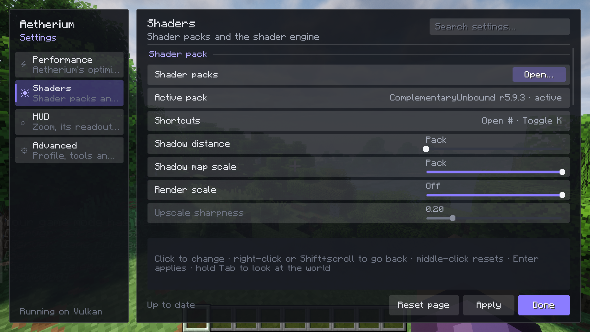

# Settings

Aetherium's settings are under **Options › Aetherium...**. Every setting has a description, tags that say what it
saves and whether it needs a restart, and is found by the search box. Changes are staged until you press **Apply**.

- [Performance](#performance)
- [Shaders](#shaders)
- [HUD](#hud)
- [Advanced](#advanced)
- [Key bindings](#key-bindings)
- [Config files](#config-files)



## Performance

- **Presets.** *Recommended* sets every optimisation to its measured default (experiments off). *All off* turns
  every optimisation off, for comparing or for tracking down a problem.
- **Memory** and **Experimental** groups: one switch per optimisation. See [Performance](performance.md) for each one.

Most memory optimisations take effect on the next start. Optimisations that change at once say **Applies instantly**.

## Shaders

| Setting | What it does |
|---|---|
| Shader packs | Opens the shader pack screen. |
| Active pack | The pack in use and its state. |
| Shortcuts | The current keys for the shader pack screen, toggle and reload. |
| Shadow distance | How far the shadow map reaches, in chunks. *Pack* keeps the pack's own value. Reloads the pack. |
| Shadow map scale | The shadow map's resolution as a share of the pack's. Reloads the pack. |
| Render scale | Draws the world at 50–100% of the window and upscales it with FSR 1.0. *Off* is 100%. |
| Upscale sharpness | How strongly the upscaled picture is sharpened; 0 is the strongest. Only with render scale on. |
| Far terrain | Shown when Distant Horizons is installed: how its terrain is drawn with the current pack. |
| Shader engine | One switch per shader engine optimisation. See [Performance](performance.md). |

## HUD

| Setting | Default | What it does |
|---|---|---|
| Zoom key | <kbd>Z</kbd> | The key to hold for zoom (change it under Controls › Key Binds). |
| Starting zoom | 4.0× | The magnification every zoom starts at. |
| Least zoom | 1.0× | How far out scrolling goes while zoomed. |
| Most zoom | 32.0× | How far in scrolling goes while zoomed. |
| Zoomed sensitivity | 100% | How fast the mouse turns the view while zoomed. At 100% a movement moves the picture equally far at any zoom. |
| Cinematic camera | On | Smooths the mouse while zoomed. |
| Readout corner | Top right | The screen corner the zoom panels sit in. |
| Coordinates panel | On | The block coordinates, distance and facing direction while zoomed. |
| Target panel | On | A 3D preview and the name of the block or mob under the crosshair while zoomed. |
| Centred crosshair | On | Puts the crosshair on the exact centre of the window. |

## Advanced

- **Optimisation profile.** *Recommended* or *Baseline (all off)*. Switching resets the single switches and needs a
  restart.
- **Tools.** Open the config folder or the logs folder, clear the shader cache, and reset every Aetherium setting to
  its default.
- **System.** The graphics API, GPU, driver, usable CPU threads and memory. If Java sees fewer CPU threads than the PC
  has (Windows processor groups), this says which JVM flag fixes it.

## Key bindings

Under Controls › Key Binds, in the **Aetherium** and **Aetherium Shaders** categories.

| Binding | Default |
|---|---|
| Shader pack screen | <kbd>O</kbd> |
| Toggle shader pack | <kbd>K</kbd> |
| Reload shader pack | unbound |
| Zoom | <kbd>Z</kbd> |

## Config files

All under `.minecraft/`.

| File | What it holds |
|---|---|
| `config/aetherium.json` | Every Aetherium setting (see below). |
| `shaderpacks/<pack>.txt` | The options you set for that pack. |
| `aetherium/shader-cache/` | Converted shader code, so packs load faster the next time. Safe to delete. |
| `aetherium/pipeline-cache.bin` | Compiled GPU pipelines, only with the experimental pipeline cache on. Safe to delete. |

`config/aetherium.json`:

```jsonc
{
  "profile": "default",                       // "default" (recommended) or "baseline" (everything off)
  "optimisations": { "shaders.shadow_cache": true },  // single switches on top of the profile
  "shaders": {
    "pack": "ComplementaryReimagined_r5.5.1.zip",  // the active pack
    "enabled": true,                          // shaders on or off (the K key)
    "renderScale": 100,                       // percent, 50-100
    "upscaleSharpness": 20,                   // hundredths of a stop, 0 = strongest
    "shadowDistance": 0,                      // chunks, 0 = the pack's value
    "shadowMapScale": 100                     // percent of the pack's resolution
  },
  "zoom": {
    "nominal": 40, "min": 10, "max": 320,     // magnifications in tenths (40 = 4.0x)
    "sensitivity": 100,                       // percent
    "cinematic": true,
    "corner": "top_right",                    // top_right, top_left, bottom_right, bottom_left
    "coordinates": true, "target": true
  },
  "crosshair": { "centred": true },
  "bench": { "gpuTimers": false, "passTimers": false }  // development tooling only
}
```

Every key is optional; anything missing takes its default.
